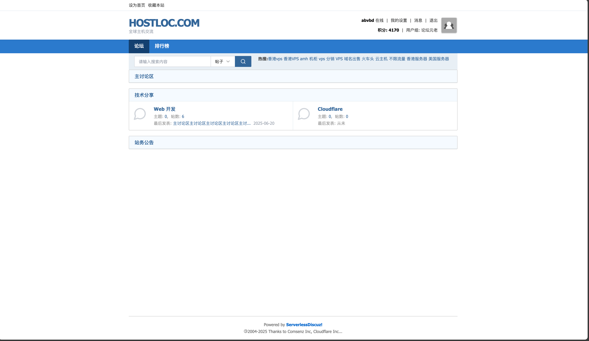

# Serverless-BBS / CFWorker BBS

纯基于 Cloudflare Worker + Pages 的类似 Discuz!3.5 程序.

## 克隆代码
```bash
git clone https://github.com/serverless-bbs/serverless-bbs.git
cd serverless-bbs
```

### 本地调试

安装 Wrangler: 如果您还没有安装 Wrangler (Cloudflare 的命令行工具)，请在您的终端中运行以下命令进行全局安装：

```bash
npm install -g wrangler
```

初始化D1数据库
```bash
# 假设您当前在 serverless-bbs/ 目录下
cd worker

# --local 为本机调试
npx wrangler d1 migrations apply community-db --local
```

安装后端依赖
```bash
# 假设您当前在 serverless-bbs/ 目录下
cd worker
yarn
```

安装前端依赖
```bash
# 假设您当前在 serverless-bbs/ 目录下
cd ui
yarn
```


启动后端
```bash
# 假设您当前在 serverless-bbs/ 目录下
cd worker
yarn dev
```

启动前端
```bash
# 假设您当前在 serverless-bbs/ 目录下
cd ui
yarn dev
```

### 线上部署

第 1 步：准备工作 (一次性)
在开始之前，请确保您已经完成了以下准备工作：

(1). 安装 Wrangler: 如果您还没有安装 Wrangler (Cloudflare 的命令行工具)，请在您的终端中运行以下命令进行全局安装：

```bash
npm install -g wrangler
```

(2). 登录 Cloudflare: 运行以下命令，它会打开一个浏览器窗口，让您登录到自己的 Cloudflare 账户，并授权 Wrangler 进行操作。

```bash
wrangler login
```

第 2 步：创建云端资源 (一次性)
您的应用依赖 D1 数据库、KV 命名空间和 R2 存储桶。您需要在 Cloudflare 控制台中手动创建它们。

(1). 登录到您的 [Cloudflare 控制台](https://dash.cloudflare.com/)。

(2). 创建 D1 数据库:
- 在左侧菜单中，找到 Workers 和 Pages > D1。
- 点击“创建数据库”。
- 为您的数据库命名（例如 community-db），然后点击“创建”。
- 创建后，记下它的 数据库 ID。

(3). 创建 KV 命名空间:
- 在左侧菜单中，找到 Workers 和 Pages > KV。
- 点击“创建命名空间”。
- 输入一个名称（例如 KV_SESSIONS），然后点击“添加”。
- 创建后，记下它的 ID。

(3). 创建 R2 存储桶:
- 在左侧菜单中，找到 R2。
- 点击“创建存储桶”。
- 输入一个全局唯一的存储桶名称（例如 yourname-community-assets），然后点击“创建存储桶”。

第 3 步：更新配置文件
这是至关重要的一步。打开您项目根目录下的 wrangler.toml 文件，找到并更新以下部分，将占位符替换为您在上一步中获得的真实值。

```wrangler.toml
# ... 其他配置 ...

# D1 数据库绑定
[[d1_databases]]
binding = "DB" 
database_name = "community-db"
database_id = "xxxxxxxx-xxxx-xxxx-xxxx-xxxxxxxxxxxx" # <--- 替换为您的 D1 数据库 ID

# KV Namespace 绑定
[[kv_namespaces]]
binding = "KV_SESSIONS"
id = "xxxxxxxxxxxxxxxxxxxxxxxxxxxxxxxx" # <--- 替换为您的 KV Namespace ID

# R2 存储桶绑定
[[r2_buckets]]
binding = "R2_BUCKET"
bucket_name = "yourname-community-assets" # <--- 替换为您的 R2 存储桶名称
```

第 4 步：执行生产数据库迁移
您的数据库结构需要被应用到云端的 D1 数据库上。在您项目的根目录下运行以下命令：

```bash
# 将 <YOUR_DB_NAME> 替换为您在第2步中创建的数据库名称
npx wrangler d1 migrations apply community-db
```

这会将 `worker/migrations/` 目录下的所有 SQL 文件应用到您的生产数据库。

第 5 步：构建前端应用
在部署之前，您需要生成前端应用的生产版本。

```bash
# 首先，进入 ui 目录
cd ui

# 运行构建命令
npm run build
```

这个命令会在 ui/ 目录下创建一个 dist/ 文件夹，里面包含了所有优化过的静态文件。

第 6 步：部署到 Cloudflare！
一切准备就绪！现在，回到您项目的根目录，运行最终的部署命令：

```bash
# 确保您在项目的根目录下
cd ..

# 运行部署命令
npx wrangler deploy
```

Wrangler 会读取您的 wrangler.toml 文件，然后自动完成所有事情：

上传并发布您的 Worker 脚本。

上传 ui/dist 目录中的所有静态文件到 Cloudflare Pages。

将您在配置文件中定义的 D1、KV 和 R2 服务绑定到您的 Worker。

部署成功后，Wrangler 会在终端中显示您的应用所部署的 *.pages.dev 域名。恭喜，您的论坛现在已经全球上线了！

## 截图





## 版本
版权不所有 (Copyleft) 授权。随意使用，但风险、后果与责任自担。